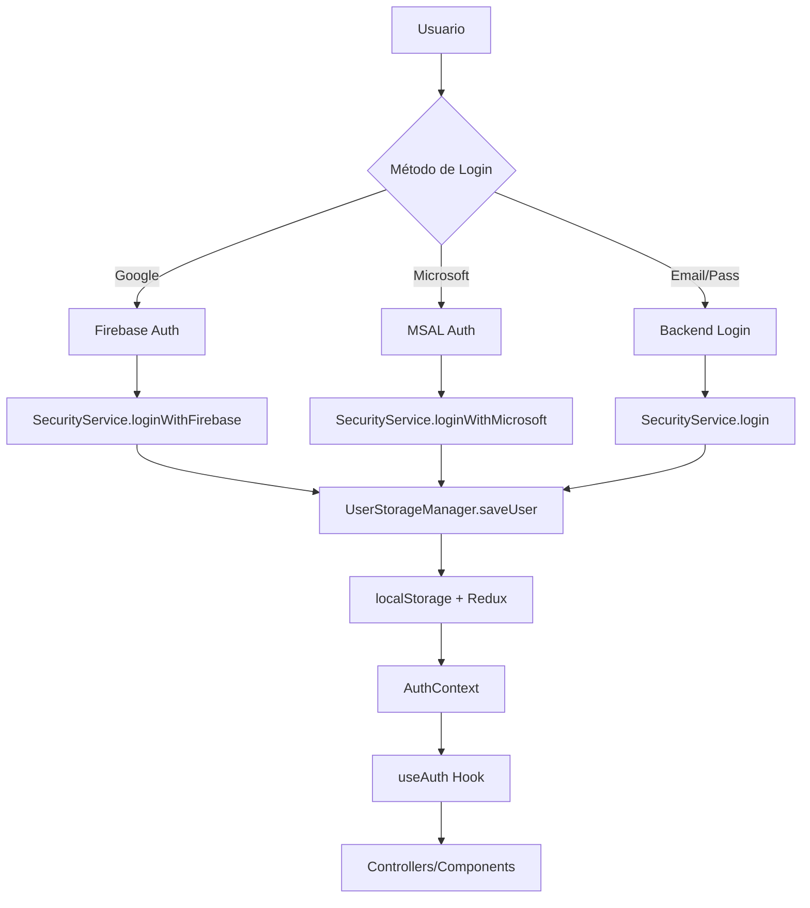

# 🔐 Documentación del Sistema de Autenticación

## 📋 **Visión General del Sistema**

Este proyecto implementa un **Sistema de Autenticación Híbrido y Centralizado** que combina múltiples proveedores de autenticación con un manejo unificado del estado del usuario.

### **🎯 Características Principales:**
- ✅ **Múltiples Proveedores**: Firebase (Google), Microsoft, Login Tradicional
- ✅ **Estado Centralizado**: Redux + AuthContext
- ✅ **Persistencia Robusta**: UserStorageManager centralizado
- ✅ **Token Único**: JWT para todas las APIs
- ✅ **Compatibilidad Legacy**: Migración automática de formatos antiguos

---

## 🏗️ **Arquitectura del Sistema**



---

## 📁 **Estructura de Archivos**

### **🔧 Core de Autenticación**
```
src/
├── context/
│   └── AuthContext.tsx          # Context principal de autenticación
├── store/
│   └── userSlice.ts            # Estado Redux del usuario
├── utils/
│   └── userStorageManager.ts   # Gestor centralizado de localStorage
├── services/
│   ├── securityService.ts      # Servicios de autenticación
│   └── auth/
│       └── FirebaseAuthProvider.ts # Proveedor Firebase
├── interceptors/
│   └── axiosInterceptor.ts     # Interceptor para APIs
└── hooks/
    └── useCurrentUser.ts       # Hook de respaldo (opcional)
```

---

## 🔄 **Flujo de Autenticación**

### **1. Inicialización de la App**
```typescript
// AuthContext.tsx - useEffect
const initializeAuth = async () => {
  // 1. Leer datos de localStorage
  const sessionToken = UserStorageManager.getSession();
  let storedUser = UserStorageManager.getUser();
  
  // 2. Migrar formato legacy si es necesario
  if (storedUser && 'user' in storedUser) {
    storedUser = storedUser.user;
    UserStorageManager.saveUser(storedUser, sessionToken);
  }
  
  // 3. Establecer usuario en contexto
  if (sessionToken && storedUser) {
    setCurrentUser(authUser);
    dispatch(setUser(storedUser));
  }
}
```

### **2. Login con Google (Firebase)**
```typescript
// Flujo: Usuario → Firebase → Backend → localStorage → Redux → AuthContext

// 1. FirebaseAuthProvider.signIn()
const result = await signInWithPopup(auth, provider);

// 2. SecurityService.loginWithFirebase()
await securityService.loginWithFirebase(result.user);

// 3. UserStorageManager.saveUser()
UserStorageManager.saveUser(userToStore, backendToken);

// 4. Redux actualización automática
dispatch(setUser(userToStore));

// 5. AuthContext recibe evento
window.dispatchEvent(new CustomEvent('authStateChanged', {
  detail: { user: userToStore, token: backendToken }
}));
```

### **3. Login Tradicional**
```typescript
// Flujo: Usuario → Backend → localStorage → Redux → AuthContext

// 1. SecurityService.login()
const response = await fetch('/api/login', {
  method: 'POST',
  body: JSON.stringify({ email, password })
});

// 2. UserStorageManager.saveUser()
const { user, token } = await response.json();
UserStorageManager.saveUser(user, token);

// 3. Redux Store
dispatch(setUser(user));
```

---

## 💾 **Gestión de Datos de Usuario**

### **UserStorageManager - Formato Estándar**
```typescript
// Estructura guardada en localStorage
{
  id: "user_id",
  email: "user@example.com",
  name: "User Name",
  displayName: "Display Name",
  photoURL: "https://...",
  provider: "google" | "microsoft" | "local",
  token: "jwt_token_here",
  lastSaved: "2025-11-05T12:00:00.000Z"
}
```

### **Métodos Principales**
```typescript
// Guardar usuario
UserStorageManager.saveUser(user: AuthUser, token?: string)

// Leer usuario
const user = UserStorageManager.getUser(): AuthUser | null

// Obtener token de sesión
const token = UserStorageManager.getSession(): string | null

// Limpiar datos
UserStorageManager.clearUser()

// Verificar si hay usuario válido
const isValid = UserStorageManager.hasValidUser(): boolean

// Debug
UserStorageManager.debugInfo()
```

---

## 🔌 **Integración con APIs**

### **Axios Interceptor**
```typescript
// axiosInterceptor.ts - Se ejecuta en cada request
api.interceptors.request.use((config) => {
  // 1. Obtener token de sesión
  const sessionToken = localStorage.getItem("session");
  
  // 2. Agregar a headers
  if (sessionToken) {
    config.headers.Authorization = `Bearer ${sessionToken}`;
  }
  
  return config;
});
```

### **Manejo de Errores 401**
```typescript
api.interceptors.response.use(
  (response) => response,
  (error) => {
    if (error.response?.status === 401) {
      // Limpiar sesión y redirigir
      UserStorageManager.clearUser();
      window.location.href = '/auth/signin';
    }
    return Promise.reject(error);
  }
);
```

---

## 🎣 **Hooks de Autenticación**

### **useAuth (Principal)**
```typescript
import { useAuth } from "../context/AuthContext";

const MyComponent = () => {
  const { currentUser, isAuthenticated, signIn, signOut } = useAuth();
  
  if (!isAuthenticated) {
    return <div>Please login</div>;
  }
  
  return <div>Welcome {currentUser.name}</div>;
};
```

### **useCurrentUser (Respaldo)**
```typescript
import { useCurrentUser } from "../hooks/useCurrentUser";

const MyComponent = () => {
  const { currentUser, email, sources } = useCurrentUser();
  
  // Información de debug disponible
  console.log("Fuentes de datos:", sources);
  
  return <div>Email: {email}</div>;
};
```

---

## 🔧 **Configuración de Proveedores**

### **Firebase Setup**
```typescript
// firebase.config.ts
export const firebaseConfig = {
  apiKey: "your-api-key",
  authDomain: "your-project.firebaseapp.com",
  projectId: "your-project-id",
  // ...
};

// AuthContext.tsx
const authProvider = new FirebaseAuthProvider(firebaseConfig);
```

### **Microsoft/MSAL Setup**
```typescript
// Configuración en componente
import { MsalProvider } from "@azure/msal-react";
import { msalConfig } from "./config/msalConfig";

<MsalProvider instance={msalInstance}>
  <App />
</MsalProvider>
```

---

## 🔒 **Seguridad y Tokens**

### **Jerarquía de Tokens**
1. **Token de Sesión** (`localStorage.session`) - Prioritario para APIs
2. **Token de Usuario** (`user.token`) - Fallback
3. **Tokens OAuth** - Solo para integración con backend

### **Expiración y Refresh**
```typescript
// En interceptor - detección de token expirado
if (error.response?.status === 401) {
  // Limpiar sesión expirada
  securityService.logout();
  // Redirigir a login
  window.location.href = '/auth/signin';
}
```

### **Logout Completo**
```typescript
// SecurityService.logout()
logout() {
  // 1. Limpiar UserStorageManager
  UserStorageManager.clearUser();
  
  // 2. Limpiar tokens OAuth específicos
  // MSAL, Firebase, etc.
  
  // 3. Limpiar Redux
  store.dispatch(setUser(null));
  
  // 4. Notificar AuthContext
  this.user = null;
}
```

---

## 🧪 **Testing y Debug**

### **Componente de Testing**
```typescript
import AuthTestComponent from "../components/AuthTestComponent";

// Agregar temporalmente a cualquier página
<AuthTestComponent />
```

### **Debug en Console**
```typescript
// Verificar estado actual
UserStorageManager.debugInfo();

// Verificar autenticación
console.log("¿Autenticado?", UserStorageManager.hasValidUser());

// Ver datos del usuario
console.log("Usuario:", UserStorageManager.getUser());
```

### **Logs del Sistema**
```typescript
// AuthContext inicialización
"✅ Sesión del backend encontrada con token válido"
"⚠️ Detectada estructura anidada legacy, corrigiendo..."

// UserStorageManager
"✅ Usuario guardado en localStorage:"
"📖 Usuario leído desde localStorage:"

// API Requests
"🔑 Agregando token de sesión: eyJ0eXAi..."
```

---

## 🚨 **Solución de Problemas**

### **Problema: "No hay usuario autenticado"**
```typescript
// 1. Verificar localStorage
UserStorageManager.debugInfo();

// 2. Verificar AuthContext
const { currentUser } = useAuth();
console.log("AuthContext user:", currentUser);

// 3. Verificar estructura de datos
const stored = localStorage.getItem("user");
console.log("Raw localStorage:", stored);
```

### **Problema: Token no se envía en requests**
```typescript
// 1. Verificar token de sesión
console.log("Session token:", localStorage.getItem("session"));

// 2. Verificar interceptor
// Ver Network tab en DevTools para header Authorization
```

### **Problema: Sesión se pierde al recargar**
```typescript
// 1. Verificar que se guarde correctamente
UserStorageManager.saveUser(user, token);

// 2. Verificar que se lea en initializeAuth
// Ver logs de AuthContext en console
```

---

## 🔄 **Migración y Compatibilidad**

### **Detección de Formato Legacy**
```typescript
// AuthContext maneja automáticamente
if (storedUser && 'user' in storedUser) {
  console.log("⚠️ Detectada estructura anidada legacy, corrigiendo...");
  storedUser = storedUser.user;
  UserStorageManager.saveUser(storedUser, sessionToken);
}
```

### **Migración Manual**
```typescript
// Si necesitas migrar datos manualmente
const oldData = JSON.parse(localStorage.getItem("user"));
if (oldData && oldData.user) {
  UserStorageManager.saveUser(oldData.user, oldData.token);
}
```

---

## 🎯 **Mejores Prácticas**

### **✅ Para Nuevos Componentes**
```typescript
// USAR
const { currentUser } = useAuth();

// NO USAR
const user = JSON.parse(localStorage.getItem("user"));
```

### **✅ Para Guardar Usuario**
```typescript
// USAR
UserStorageManager.saveUser(user, token);

// NO USAR
localStorage.setItem("user", JSON.stringify(user));
```

### **✅ Para Verificar Autenticación**
```typescript
// USAR
if (!currentUser?.email) return;

// TAMBIÉN VÁLIDO
if (!UserStorageManager.hasValidUser()) return;
```

---

## 📚 **Extensibilidad**

### **Agregar Nuevo Proveedor OAuth**
1. Crear provider en `src/services/auth/`
2. Integrar con `SecurityService`
3. Usar `UserStorageManager.saveUser()`
4. Eventos a `AuthContext`

### **Agregar Nuevos Campos de Usuario**
1. Actualizar `AuthUser` interface
2. Modificar `UserStorageManager.saveUser()`
3. Verificar compatibilidad con backend

---

Este sistema está diseñado para ser **robusto**, **escalable** y **fácil de mantener**, con manejo automático de múltiples proveedores de autenticación y migración transparente de formatos legacy.